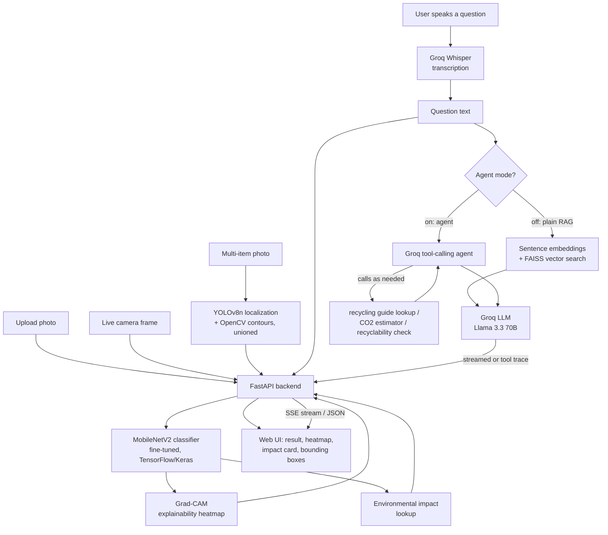
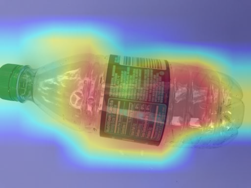
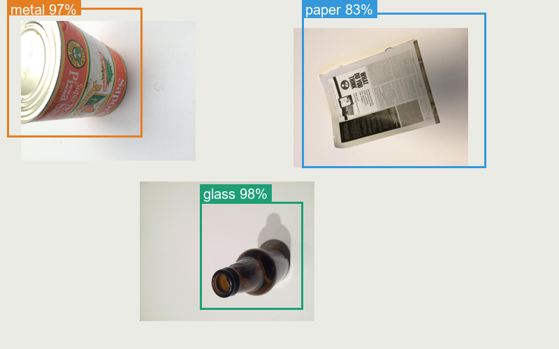
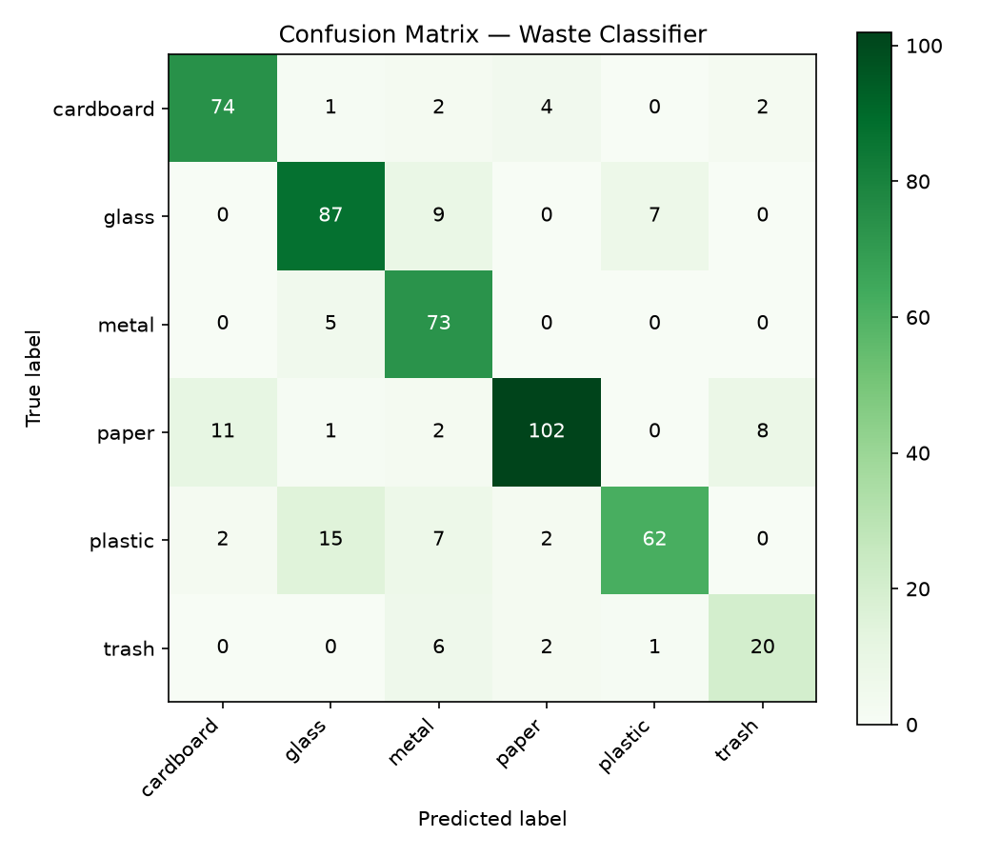

# ♻️ Smart Waste Classifier

AI-powered waste classification with a Groq-backed recycling assistant — upload a
photo, get an instant category prediction from a fine-tuned MobileNetV2 model, and
ask a RAG-grounded chatbot follow-up questions about how to recycle it.

**Live demo:** _deploying now — see [DEPLOYMENT.md](DEPLOYMENT.md) to run your own copy in minutes_


---

## What it does

1. **Upload a photo, use your live camera, or drop a multi-item photo:**
   - **Upload mode** — classify a single photo with the full analysis (confidence,
     Grad-CAM, environmental impact).
   - **Live Camera mode** — point your webcam at an item and get continuous,
     real-time classification (~every 2 seconds) directly in the browser.
   - **Multi-Item mode** — drop a photo with several items laid out together
     (e.g. sorting a table of trash) and get each one individually localized
     with a bounding box and classified.
2. A **fine-tuned MobileNetV2** CNN classifies each item and returns a
   confidence score and per-class probability breakdown.
3. **See *why* the model decided that** — a **Grad-CAM heatmap** overlays the
   image showing exactly which pixels the network focused on, turning the CNN
   from a black box into something you can visually audit.
4. See the **environmental impact** of recycling that item (approximate CO₂ and
   energy savings vs. producing it from raw material).
5. Ask the **AI recycling assistant** (powered by [Groq](https://groq.com), backed
   by **retrieval-augmented generation with real sentence embeddings + FAISS
   vector search** over a curated recycling knowledge base) follow-up questions
   like *"can I recycle this if it's dirty?"* — by **typing or by voice**
   (speech is transcribed with Groq Whisper) — and get a grounded, streamed
   answer.
6. Flip on **🤖 Agent mode** and the assistant becomes a genuine **tool-calling
   AI agent**: instead of answering from text alone, it autonomously decides to
   call real functions — look up a material's recycling guide, calculate CO₂
   saved for a given weight, check recyclability — and you can see exactly
   which tools it used for each answer.
7. **Installable as an app** — the frontend is a Progressive Web App (manifest +
   service worker), so it can be added to a phone's home screen and used like
   a native app.

## Architecture



## Tech stack

| Layer               | Technology                                                        |
|---------------------|--------------------------------------------------------------------|
| Computer vision     | TensorFlow / Keras, MobileNetV2 transfer learning + fine-tuning, class-weighted + best-epoch training |
| Model optimization   | ONNX Runtime export + dynamic int8 quantization, benchmarked against the Keras baseline |
| Explainable AI       | Grad-CAM (gradient-based class activation mapping), implemented from scratch with `tf.GradientTape` |
| Multi-item detection | Pretrained YOLOv8n (ultralytics) + OpenCV contour proposals, unioned and resolved via confidence-based suppression |
| Backend API         | FastAPI, Pydantic, Uvicorn                                          |
| Generative AI       | Groq API (Llama 3.3 70B) — streaming chat, **tool-calling agent**, + Whisper speech-to-text |
| Retrieval (RAG)     | Sentence-transformer embeddings (`all-MiniLM-L6-v2`) + FAISS vector search over a markdown knowledge base |
| Frontend            | Vanilla HTML/CSS/JS, live camera (MediaRecorder/getUserMedia), server-sent streaming chat |
| PWA                  | Web app manifest + service worker — installable, offline-capable app shell |
| i18n                 | English / Urdu UI with RTL layout, bilingual AI assistant           |
| Testing             | Pytest, FastAPI TestClient                                           |
| Quality             | Ruff (lint)                                                          |
| Packaging / deploy  | Docker (full + memory-optimized lite profile), GitHub Actions CI/CD |

## Explainable AI: Grad-CAM

Every prediction includes a **Grad-CAM heatmap** — computed with `tf.GradientTape`
against the last convolutional layer of the MobileNetV2 backbone (`src/waste_classifier/ml/explain.py`) —
so you can visually verify the model is actually looking at the object, not
background artifacts or dataset bias:



*(Example: classified as "plastic" at 99.8% confidence — the heatmap shows the model focusing on the bottle body and label, not the background.)*

## Agentic AI: tool-calling assistant

Flip on **🤖 Agent mode** in the chat and the assistant stops answering from
text alone — it's given a set of real tools (`src/waste_classifier/genai/tools.py`)
and autonomously decides which to call, with what arguments, before responding:

- `lookup_recycling_guide(material)` — pulls the curated knowledge-base entry
- `estimate_environmental_impact(material, weight_kg)` — computes real CO₂ savings
- `check_recyclability(material)` — quick true/false lookup

Example (real output, not scripted): asked *"How much CO2 do I save recycling
2kg of aluminum cans? Also, can I recycle a greasy pizza box?"*, the agent
independently called **both** `estimate_environmental_impact` (material=metal,
weight_kg=2 → 18kg CO2 saved) and `lookup_recycling_guide` (material=paper),
then combined both results into one answer — a genuine multi-step agent loop
(`src/waste_classifier/genai/agent.py`), not a single scripted RAG lookup. The
UI shows a small trace of which tools were used for each answer.

## Multi-item detection

The **Multi-Item** mode localizes several objects in one photo and classifies
each region independently. Localization unions two complementary sources: a
**pretrained YOLOv8n** (real object detector, trained on COCO — used only for
"where is an object", its COCO class label is discarded) plus OpenCV contour
detection. Neither alone is sufficient: YOLO's learned priors catch upright,
COCO-familiar shapes (bottles, books) that classical CV misses amid background
clutter, but has no COCO class for e.g. a can lying on its side, which
classical CV catches fine from contrast alone.



*(Example: three items in one composite photo, each correctly localized and classified.)*

## Model optimization: ONNX + quantization

`python -m waste_classifier.ml.export_onnx` exports the trained Keras model to
ONNX, quantizes it to int8, and benchmarks all three serving paths on the same
CPU (30 runs each, single-image latency):

| Format              | Latency  | Speedup vs. Keras | Size    |
|---------------------|----------|--------------------|---------|
| Keras (baseline)     | 326.9 ms | 1.0x               | 27.1 MB |
| ONNX (fp32)          | 25.6 ms  | **12.75x**         | 8.9 MB  |
| ONNX (int8, quantized) | 120.7 ms | 2.71x            | 2.4 MB  |

Full numbers: [`artifacts/metrics/onnx_benchmark.json`](artifacts/metrics/onnx_benchmark.json).

Note the quantized model is *slower* than plain fp32 ONNX here despite being
smaller — a real, honest result: this CPU has no AVX512-VNNI acceleration for
int8 ops, so dynamic quantization adds dequantization overhead without a
matching speed win. Its **91% size reduction** is still valuable for
bandwidth/storage-constrained edge deployment, just not for raw CPU latency on
this hardware — the right format depends on what you're actually optimizing
for. `src/waste_classifier/ml/onnx_classifier.py` provides a drop-in
`OnnxWasteClassifier` with the same interface as the Keras classifier for
anyone who wants the ONNX path in production (not wired in as the default,
since Grad-CAM needs real gradient-tape access that ONNX Runtime's
inference-only graph doesn't expose).

## Model performance

Evaluated on a held-out 20% validation split (505 images) with
`python -m waste_classifier.ml.evaluate`. Full numbers live in
[`artifacts/metrics/metrics.json`](artifacts/metrics/metrics.json).

**Overall validation accuracy: 82.8%**

| Class      | Precision | Recall | F1   | Support |
|------------|-----------|--------|------|---------|
| cardboard  | 0.85      | 0.89   | 0.87 | 83      |
| glass      | 0.80      | 0.84   | 0.82 | 103     |
| metal      | 0.74      | 0.94   | 0.82 | 78      |
| paper      | 0.93      | 0.82   | 0.87 | 124     |
| plastic    | 0.89      | 0.70   | 0.78 | 88      |
| trash      | 0.67      | 0.69   | 0.68 | 29      |



Trained on the [TrashNet dataset](https://github.com/garythung/trashnet) (~2,527
images across 6 classes) using a two-stage transfer-learning approach: first
training a classification head on top of a frozen MobileNetV2 backbone, then
fine-tuning the top layers of the backbone at a low learning rate — with
**inverse-frequency class weighting** (to correct for TrashNet's imbalance,
since "trash" has ~3-4x fewer images than other classes) and
**`EarlyStopping(restore_best_weights=True)`** so the saved model is whichever
epoch had the best validation accuracy, not just the last one trained.

That class-weighting fix specifically targeted the model's weakest class:
**trash's F1 score rose from 0.57 to 0.68** (recall 0.55 → 0.69) between the
first and second training runs, at a small cost to cardboard/metal precision.
The remaining confusion is concentrated at the **glass ↔ plastic** boundary
(transparent containers look visually similar) and the still-small **trash**
class (only ~137 source images total) — both realistic, well-understood
failure modes rather than random error, and the clearest targets for further
improvement (more trash images, or a higher-capacity backbone).

## Project structure

```
waste-classifier/
├── src/waste_classifier/
│   ├── api/            # FastAPI app, routes, request/response schemas
│   ├── ml/              # training, evaluation, inference, Grad-CAM, impact facts
│   ├── genai/           # Groq client + recycling assistant + Whisper transcription
│   ├── rag/             # knowledge base loader + embeddings/FAISS retriever (TF-IDF fallback)
│   └── config.py        # centralized configuration (env-driven)
├── data/
│   ├── dataset/          # TrashNet images (download separately, see below)
│   └── knowledge_base/   # markdown recycling knowledge base (used for RAG)
├── artifacts/            # trained model, class names, metrics, confusion matrix
├── web/                  # static frontend (upload UI + chat widget)
├── tests/                # pytest suite (classifier, RAG, API)
├── docker/Dockerfile
├── docker-compose.yml
└── .github/workflows/    # CI (tests + lint)
```

## Running locally

### 1. Setup

```bash
python -m venv venv
venv\Scripts\activate        # Windows
# source venv/bin/activate   # macOS/Linux

pip install -r requirements-dev.txt
cp .env.example .env         # then add your GROQ_API_KEY (free at console.groq.com)
```

### 2. Get the dataset (only needed if you want to retrain the model)

Download [TrashNet](https://github.com/garythung/trashnet)
(`data/dataset-resized.zip`), extract it, and place the class folders under
`data/dataset/` (already done if you cloned this repo with the pretrained
model in `artifacts/`).

### 3. (Optional) Train / fine-tune the model

```bash
python -m waste_classifier.ml.train
python -m waste_classifier.ml.evaluate
```

### 4. Run the app

```bash
uvicorn waste_classifier.api.main:app --reload --app-dir src
```

Open http://127.0.0.1:8000 — interactive API docs are at
http://127.0.0.1:8000/docs.

### 5. Run tests

```bash
pytest
ruff check src tests
```

### 6. Run with Docker

```bash
docker compose up --build
```

## Deployment

Two Docker profiles are included: the full app (`docker/Dockerfile`) and a
**lightweight profile** (`docker/Dockerfile.lite`) sized for free-tier hosts with
limited RAM — it swaps the embeddings+FAISS RAG retriever for a TF-IDF fallback,
disables Grad-CAM, and tunes TensorFlow's thread pools, cutting peak memory from
~560MB to ~220MB per request. See [DEPLOYMENT.md](DEPLOYMENT.md) for the full
deployment guide (Render, recommended and free with no card required).

## What I learned / engineering notes

- Two-stage transfer learning (frozen head training, then fine-tuning the top
  backbone layers at a low LR) meaningfully improves validation accuracy over
  feature-extraction alone.
- TrashNet is imbalanced (the "trash" class has roughly 3-4x fewer images than
  the others), which was silently hurting recall on that class. Fixed with
  inverse-frequency class weighting during training, plus
  `EarlyStopping(restore_best_weights=True)` so the saved model is whichever
  epoch had the best validation accuracy rather than just the last one.
- Upgraded the RAG layer from an initial TF-IDF/keyword retriever to real
  sentence embeddings (`all-MiniLM-L6-v2`) + FAISS vector search — this
  correctly matches paraphrased questions (e.g. "why does one bad item ruin
  the whole batch" → the knowledge base's "contamination" section) that share
  almost no exact keywords with the source text, which TF-IDF could not do.
- Groq was chosen for the LLM layer for its generous free tier and very low
  latency, making the streamed chat experience feel instant.
- Implemented Grad-CAM from scratch with `tf.GradientTape` (rather than pulling
  in a black-box explainability library) to directly control which layer is
  visualized and how it plugs into the existing Keras `Sequential` model.
- Multi-item detection combines a pretrained YOLOv8n with classical CV rather
  than picking one — an early test on a 3-item composite photo showed YOLO
  alone found only 1/3 items (COCO has no "can lying on its side" class),
  while classical CV alone found all 3 but has no learned object priors for
  cluttered real photos. Unioning both candidate sets before the existing
  confidence-based suppression step gets the coverage of both without
  training a detector from scratch, which TrashNet's lack of bounding-box
  labels rules out anyway.
- Chose to give the recycling assistant real tool-calling (Groq function
  calling) as an opt-in "Agent mode" alongside the existing RAG-only mode,
  rather than replacing it — RAG-only is faster for simple questions, while
  the agent loop is worth the extra round-trips for compound/quantitative
  questions (e.g. "how much CO2 for 2kg of X") that need actual computation
  rather than retrieved text.
- Exporting to ONNX surfaced a real Keras 3 compatibility gap: tf2onnx's
  `from_keras()` fails on Keras 3's internal tensor naming, and even
  `from_saved_model()` failed separately because the training-only
  augmentation layers' internal SeedGenerator state isn't reachable from a
  custom serving signature. Fixed by exporting a rebuilt inference-only
  model (same trained layer objects, augmentation excluded) via
  `tf2onnx.convert.from_function()` directly — no manual weight copying
  needed since the layer objects themselves carry their trained weights.
- Measured (rather than assumed) memory usage before picking a free hosting
  tier: profiling showed Grad-CAM's extra gradient pass added ~150MB per
  request, and TensorFlow's default multi-threaded pools roughly doubled
  baseline memory (~430MB → ~220MB after pinning to 1 thread) for negligible
  speed gain on a single-vCPU host. That data — not guesswork — is what the
  lightweight deployment profile is built around.
- Voice input reuses the same Groq account for speech-to-text (Whisper), so the
  whole GenAI surface — chat, RAG, and transcription — runs through one
  provider and one API key.

## Acknowledgments

- [TrashNet](https://github.com/garythung/trashnet) by Gary Thung & Mindy Yang — the labeled image dataset the classifier is trained on.
- [Groq](https://groq.com) — LLM and Whisper inference.
- [Ultralytics YOLOv8](https://github.com/ultralytics/ultralytics) — pretrained object localization.

## Author

Built by [Muhammad Moeed](https://github.com/muhammadmoeed1).

## License

MIT — see [LICENSE](LICENSE).
