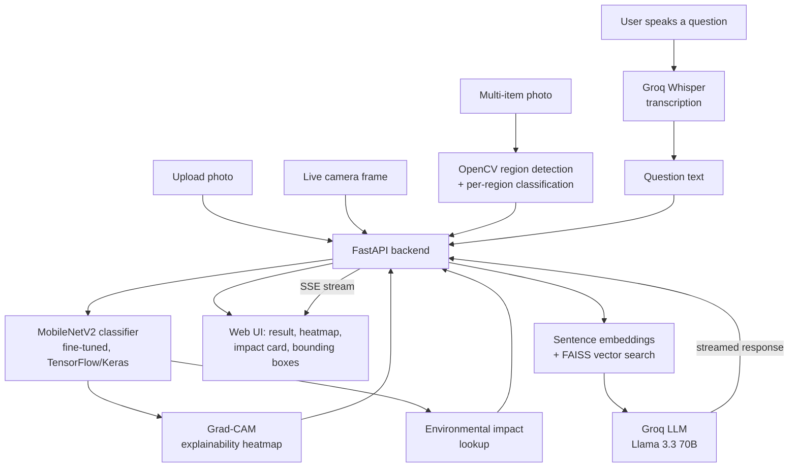

# ♻️ Smart Waste Classifier

AI-powered waste classification with a Groq-backed recycling assistant — upload a
photo, get an instant category prediction from a fine-tuned MobileNetV2 model, and
ask a RAG-grounded chatbot follow-up questions about how to recycle it.

**Live demo:** _add your deployed URL here after following [DEPLOYMENT.md](DEPLOYMENT.md)_


---

## What it does

1. **Upload a photo, use your live camera, or drop a multi-item photo:**
   - **Upload mode** — classify a single photo with the full analysis (confidence,
     Grad-CAM, environmental impact).
   - **Live Camera mode** — point your webcam at an item and get continuous,
     real-time classification (~every 2 seconds) directly in the browser.
   - **Multi-Item mode** — drop a photo with several items laid out together
     (e.g. sorting a table of trash) and get each one individually localized
     with a bounding box and classified.
2. A **fine-tuned MobileNetV2** CNN classifies each item and returns a
   confidence score and per-class probability breakdown.
3. **See *why* the model decided that** — a **Grad-CAM heatmap** overlays the
   image showing exactly which pixels the network focused on, turning the CNN
   from a black box into something you can visually audit.
4. See the **environmental impact** of recycling that item (approximate CO₂ and
   energy savings vs. producing it from raw material).
5. Ask the **AI recycling assistant** (powered by [Groq](https://groq.com), backed
   by **retrieval-augmented generation with real sentence embeddings + FAISS
   vector search** over a curated recycling knowledge base) follow-up questions
   like *"can I recycle this if it's dirty?"* — by **typing or by voice**
   (speech is transcribed with Groq Whisper) — and get a grounded, streamed
   answer.
6. **Installable as an app** — the frontend is a Progressive Web App (manifest +
   service worker), so it can be added to a phone's home screen and used like
   a native app.

## Architecture



## Tech stack

| Layer               | Technology                                                        |
|---------------------|--------------------------------------------------------------------|
| Computer vision     | TensorFlow / Keras, MobileNetV2 transfer learning + fine-tuning, class-weighted + best-epoch training |
| Explainable AI       | Grad-CAM (gradient-based class activation mapping), implemented from scratch with `tf.GradientTape` |
| Multi-item detection | OpenCV contour/edge-based region proposals + confidence-based suppression, each region classified by the same CNN |
| Backend API         | FastAPI, Pydantic, Uvicorn                                          |
| Generative AI       | Groq API (Llama 3.3 70B) — streaming chat completions + Whisper speech-to-text |
| Retrieval (RAG)     | Sentence-transformer embeddings (`all-MiniLM-L6-v2`) + FAISS vector search over a markdown knowledge base |
| Frontend            | Vanilla HTML/CSS/JS, live camera (MediaRecorder/getUserMedia), server-sent streaming chat |
| PWA                  | Web app manifest + service worker — installable, offline-capable app shell |
| Testing             | Pytest, FastAPI TestClient                                           |
| Quality             | Ruff (lint)                                                          |
| Packaging / deploy  | Docker, Docker Compose, GitHub Actions CI/CD, Hugging Face Spaces    |

## Explainable AI: Grad-CAM

Every prediction includes a **Grad-CAM heatmap** — computed with `tf.GradientTape`
against the last convolutional layer of the MobileNetV2 backbone (`src/waste_classifier/ml/explain.py`) —
so you can visually verify the model is actually looking at the object, not
background artifacts or dataset bias:


*(Example: classified as "plastic" at 99.8% confidence — the heatmap shows the model focusing on the bottle body and label, not the background.)*

## Multi-item detection

The **Multi-Item** mode localizes several objects in one photo (OpenCV contour
detection) and classifies each region independently:


*(Example: three items in one composite photo, each correctly localized and classified.)*

## Model performance

Evaluated on a held-out 20% validation split (505 images) with
`python -m waste_classifier.ml.evaluate`. Full numbers live in
[`artifacts/metrics/metrics.json`](artifacts/metrics/metrics.json).

**Overall validation accuracy: 82.8%**

| Class      | Precision | Recall | F1   | Support |
|------------|-----------|--------|------|---------|
| cardboard  | 0.85      | 0.89   | 0.87 | 83      |
| glass      | 0.80      | 0.84   | 0.82 | 103     |
| metal      | 0.74      | 0.94   | 0.82 | 78      |
| paper      | 0.93      | 0.82   | 0.87 | 124     |
| plastic    | 0.89      | 0.70   | 0.78 | 88      |
| trash      | 0.67      | 0.69   | 0.68 | 29      |


Trained on the [TrashNet dataset](https://github.com/garythung/trashnet) (~2,527
images across 6 classes) using a two-stage transfer-learning approach: first
training a classification head on top of a frozen MobileNetV2 backbone, then
fine-tuning the top layers of the backbone at a low learning rate — with
**inverse-frequency class weighting** (to correct for TrashNet's imbalance,
since "trash" has ~3-4x fewer images than other classes) and
**`EarlyStopping(restore_best_weights=True)`** so the saved model is whichever
epoch had the best validation accuracy, not just the last one trained.

That class-weighting fix specifically targeted the model's weakest class:
**trash's F1 score rose from 0.57 to 0.68** (recall 0.55 → 0.69) between the
first and second training runs, at a small cost to cardboard/metal precision.
The remaining confusion is concentrated at the **glass ↔ plastic** boundary
(transparent containers look visually similar) and the still-small **trash**
class (only ~137 source images total) — both realistic, well-understood
failure modes rather than random error, and the clearest targets for further
improvement (more trash images, or a higher-capacity backbone).

## Project structure

```
waste-classifier/
├── src/waste_classifier/
│   ├── api/            # FastAPI app, routes, request/response schemas
│   ├── ml/              # training, evaluation, inference, Grad-CAM, impact facts
│   ├── genai/           # Groq client + recycling assistant + Whisper transcription
│   ├── rag/             # knowledge base loader + TF-IDF retriever
│   └── config.py        # centralized configuration (env-driven)
├── data/
│   ├── dataset/          # TrashNet images (download separately, see below)
│   └── knowledge_base/   # markdown recycling knowledge base (used for RAG)
├── artifacts/            # trained model, class names, metrics, confusion matrix
├── web/                  # static frontend (upload UI + chat widget)
├── tests/                # pytest suite (classifier, RAG, API)
├── docker/Dockerfile
├── docker-compose.yml
└── .github/workflows/    # CI (tests + lint) and HF Spaces deploy
```

## Running locally

### 1. Setup

```bash
python -m venv venv
venv\Scripts\activate        # Windows
# source venv/bin/activate   # macOS/Linux

pip install -r requirements-dev.txt
cp .env.example .env         # then add your GROQ_API_KEY (free at console.groq.com)
```

### 2. Get the dataset (only needed if you want to retrain the model)

Download [TrashNet](https://github.com/garythung/trashnet)
(`data/dataset-resized.zip`), extract it, and place the class folders under
`data/dataset/` (already done if you cloned this repo with the pretrained
model in `artifacts/`).

### 3. (Optional) Train / fine-tune the model

```bash
python -m waste_classifier.ml.train
python -m waste_classifier.ml.evaluate
```

### 4. Run the app

```bash
uvicorn waste_classifier.api.main:app --reload --app-dir src
```

Open http://127.0.0.1:8000 — interactive API docs are at
http://127.0.0.1:8000/docs.

### 5. Run tests

```bash
pytest
ruff check src tests
```

### 6. Run with Docker

```bash
docker compose up --build
```

## Deployment

See [DEPLOYMENT.md](DEPLOYMENT.md) for deploying to Hugging Face Spaces (free,
recommended) or Render, including an automated GitHub Actions deploy workflow.

## What I learned / engineering notes

- Two-stage transfer learning (frozen head training, then fine-tuning the top
  backbone layers at a low LR) meaningfully improves validation accuracy over
  feature-extraction alone.
- TrashNet is imbalanced (the "trash" class has roughly 3-4x fewer images than
  the others), which was silently hurting recall on that class. Fixed with
  inverse-frequency class weighting during training, plus
  `EarlyStopping(restore_best_weights=True)` so the saved model is whichever
  epoch had the best validation accuracy rather than just the last one.
- Upgraded the RAG layer from an initial TF-IDF/keyword retriever to real
  sentence embeddings (`all-MiniLM-L6-v2`) + FAISS vector search — this
  correctly matches paraphrased questions (e.g. "why does one bad item ruin
  the whole batch" → the knowledge base's "contamination" section) that share
  almost no exact keywords with the source text, which TF-IDF could not do.
- Groq was chosen for the LLM layer for its generous free tier and very low
  latency, making the streamed chat experience feel instant.
- Implemented Grad-CAM from scratch with `tf.GradientTape` (rather than pulling
  in a black-box explainability library) to directly control which layer is
  visualized and how it plugs into the existing Keras `Sequential` model.
- Multi-item detection deliberately uses classical CV (OpenCV contour/edge
  detection) rather than training a deep object detector like YOLO, since
  TrashNet has no bounding-box labels to train one on. Candidate regions are
  found liberally (including overlapping/nested ones) and then reduced with
  confidence-based suppression — analogous to non-max suppression in a real
  detector, but scored by the classifier's own confidence rather than a
  learned objectness score.
- Voice input reuses the same Groq account for speech-to-text (Whisper), so the
  whole GenAI surface — chat, RAG, and transcription — runs through one
  provider and one API key.

## License

MIT — see [LICENSE](LICENSE).
