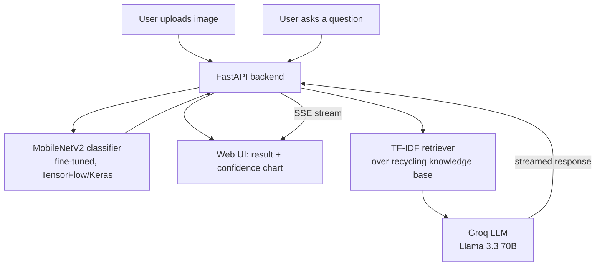

# ♻️ Smart Waste Classifier

AI-powered waste classification with a Groq-backed recycling assistant — upload a
photo, get an instant category prediction from a fine-tuned MobileNetV2 model, and
ask a RAG-grounded chatbot follow-up questions about how to recycle it.

**Live demo:** _add your deployed URL here after following [DEPLOYMENT.md](DEPLOYMENT.md)_


---

## What it does

1. **Upload an image** of an item (cardboard, glass, metal, paper, plastic, or trash).
2. A **fine-tuned MobileNetV2** CNN classifies it and returns a confidence score
   and per-class probability breakdown.
3. Ask the **AI recycling assistant** (powered by [Groq](https://groq.com), backed
   by retrieval-augmented generation over a curated recycling knowledge base)
   follow-up questions like *"can I recycle this if it's dirty?"* and get a
   grounded, streamed answer.

## Architecture



## Tech stack

| Layer               | Technology                                                        |
|---------------------|--------------------------------------------------------------------|
| Computer vision     | TensorFlow / Keras, MobileNetV2 transfer learning + fine-tuning     |
| Backend API         | FastAPI, Pydantic, Uvicorn                                          |
| Generative AI       | Groq API (Llama 3.3 70B), streaming chat completions                |
| Retrieval (RAG)     | Custom TF-IDF + cosine-similarity retriever (scikit-learn) over a markdown knowledge base |
| Frontend            | Vanilla HTML/CSS/JS, server-sent streaming chat                     |
| Testing             | Pytest, FastAPI TestClient                                           |
| Quality             | Ruff (lint)                                                          |
| Packaging / deploy  | Docker, Docker Compose, GitHub Actions CI/CD, Hugging Face Spaces    |

## Model performance

See [`artifacts/metrics/metrics.json`](artifacts/metrics/metrics.json) and the
confusion matrix below (generated by `python -m waste_classifier.ml.evaluate`
on the held-out validation split):

<!-- METRICS_TABLE_PLACEHOLDER -->


Trained on the [TrashNet dataset](https://github.com/garythung/trashnet) (~2,527
images across 6 classes) using a two-stage transfer-learning approach: first
training a classification head on top of a frozen MobileNetV2 backbone, then
fine-tuning the top layers of the backbone at a low learning rate.

## Project structure

```
waste-classifier/
├── src/waste_classifier/
│   ├── api/            # FastAPI app, routes, request/response schemas
│   ├── ml/              # training, evaluation, inference wrapper
│   ├── genai/           # Groq client + recycling assistant
│   ├── rag/             # knowledge base loader + TF-IDF retriever
│   └── config.py        # centralized configuration (env-driven)
├── data/
│   ├── dataset/          # TrashNet images (download separately, see below)
│   └── knowledge_base/   # markdown recycling knowledge base (used for RAG)
├── artifacts/            # trained model, class names, metrics, confusion matrix
├── web/                  # static frontend (upload UI + chat widget)
├── tests/                # pytest suite (classifier, RAG, API)
├── docker/Dockerfile
├── docker-compose.yml
└── .github/workflows/    # CI (tests + lint) and HF Spaces deploy
```

## Running locally

### 1. Setup

```bash
python -m venv venv
venv\Scripts\activate        # Windows
# source venv/bin/activate   # macOS/Linux

pip install -r requirements-dev.txt
cp .env.example .env         # then add your GROQ_API_KEY (free at console.groq.com)
```

### 2. Get the dataset (only needed if you want to retrain the model)

Download [TrashNet](https://github.com/garythung/trashnet)
(`data/dataset-resized.zip`), extract it, and place the class folders under
`data/dataset/` (already done if you cloned this repo with the pretrained
model in `artifacts/`).

### 3. (Optional) Train / fine-tune the model

```bash
python -m waste_classifier.ml.train
python -m waste_classifier.ml.evaluate
```

### 4. Run the app

```bash
uvicorn waste_classifier.api.main:app --reload --app-dir src
```

Open http://127.0.0.1:8000 — interactive API docs are at
http://127.0.0.1:8000/docs.

### 5. Run tests

```bash
pytest
ruff check src tests
```

### 6. Run with Docker

```bash
docker compose up --build
```

## Deployment

See [DEPLOYMENT.md](DEPLOYMENT.md) for deploying to Hugging Face Spaces (free,
recommended) or Render, including an automated GitHub Actions deploy workflow.

## What I learned / engineering notes

- Two-stage transfer learning (frozen head training, then fine-tuning the top
  backbone layers at a low LR) meaningfully improves validation accuracy over
  feature-extraction alone.
- Chose a lightweight TF-IDF retriever over a full embedding-model + vector-DB
  stack for the RAG layer, since the knowledge base is small — this keeps the
  Docker image small and avoids a heavy `sentence-transformers`/`torch`
  dependency for negligible quality gain at this scale.
- Groq was chosen for the LLM layer for its generous free tier and very low
  latency, making the streamed chat experience feel instant.

## License

MIT — see [LICENSE](LICENSE).
